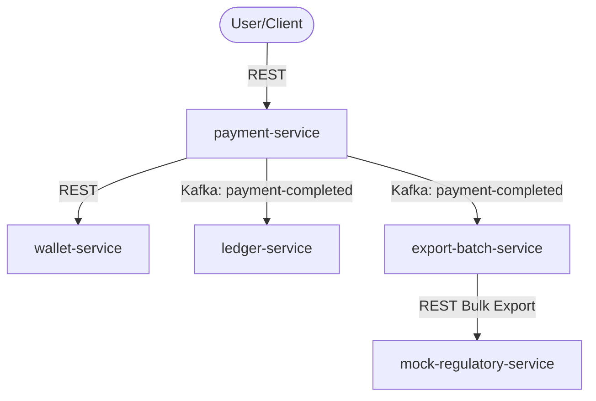

# StateMachine Payments Ecosystem

This is the main root module of the **StateMachine Payments** project, a highly resilient, event-driven payment processing system built using Spring Boot, Spring State Machine, Spring Batch, Apache Kafka, PostgreSQL, and Redis.

---

## 🧭 Navigation

- 🏠 **[Workspace Root README](file:///home/damian/sandbox/README.md)**
- 📁 **Services and Submodules:**
  - [`payments-common`](file:///home/damian/sandbox/statemachine-payments/payments-common/README.md) - Common Models and DTOs
  - [`payment-service`](file:///home/damian/sandbox/statemachine-payments/payment-service/README.md) - Payment State Machine Engine
  - [`wallet-service`](file:///home/damian/sandbox/statemachine-payments/wallet-service/README.md) - Balance Management
  - [`ledger-service`](file:///home/damian/sandbox/statemachine-payments/ledger-service/README.md) - Financial Accounting Book
  - [`export-batch-service`](file:///home/damian/sandbox/statemachine-payments/export-batch-service/README.md) - Settlement Batch Processor
  - [`mock-regulatory-service`](file:///home/damian/sandbox/statemachine-payments/mock-regulatory-service/README.md) - External Audit Simulation

---

## 📐 Architecture Overview



The system processes financial transactions with transactional safety:
1. **Initiation**: `payment-service` registers a new payment.
2. **Reservation**: It queries `wallet-service` to authorize and reserve balances.
3. **Execution & Event Generation**: On success, the payment state machine transitions to `COMPLETED` and publishes events to Apache Kafka.
4. **Accounting**: `ledger-service` consumes events to record immutable credit/debit entries.
5. **Regulatory Settlement**: `export-batch-service` runs a scheduled micro-batch process to ingest Kafka logs, partition workloads, and upload data to the `mock-regulatory-service`.

---

## 🛠️ Build & Verification Guide

### Prerequisites
- Java 25
- Apache Maven 3.9+
- Running instance of PostgreSQL and Kafka

### Verification Commands
The system adheres to strict quality checks:

```bash
# Clean and compile the entire project
mvn clean compile

# Checkstyle analysis
mvn checkstyle:check

# Run unit and integration tests
mvn test

# Generate coverage reports
mvn jacoco:report
```

---

## 📊 Observability & Metrics

Each service exposes:
- **Actuator Endpoints** under `/actuator` for health check, info, and metrics.
- **OpenAPI 3 UI** under `/swagger-ui.html` for API testing.
- **Grafana Dashboards** (configured under Kubernetes metrics) capture job throughput, processing time, state machine transitions, and Spring Batch partitioning.
