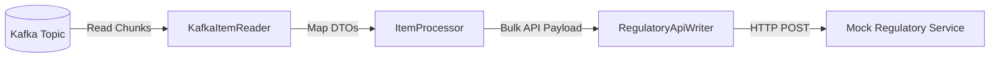

# Export Batch Service

The **Export Batch Service** is a highly reliable micro-batch processor built on **Spring Batch**. It acts as a bridge between the real-time event-driven core (Kafka) and slow third-party regulatory endpoints.

---

## 🧭 Navigation

- 🏠 **[Workspace Root README](../../README.md)**
- 📁 **[StateMachine Payments Root README](../README.md)**

---

## 🏗️ Design & Processing Flow

Every 30 seconds, a scheduled cron task starts the Spring Batch Job:

1. **Read**: `KafkaItemReader` pulls uncommitted `PAYMENT_COMPLETED` events. Kafka auto-commit is disabled (`enable.auto.commit = false`) to guarantee at-least-once delivery.
2. **Process**: Transforms the raw event DTOs into regulatory compliant formats.
3. **Write**: `RegulatoryApiWriter` bundles records into chunks and executes a bulk HTTP request to the external API.
4. **Offset Commit**: Kafka offsets are committed to the broker only after the chunk write successfully completes.

### ⚡ Scaling & Remote Partitioning
To handle traffic spikes, the batch system supports:
- **`OffsetRangePartitioner`**: Divides partition offset ranges among multiple worker threads.
- **Local/Remote Partitioning**: Distributes execution steps across local threads or remote worker nodes.
- **Retry & Recovery**: Includes custom resilience interceptors to retry on network timeouts or database locking failures.
