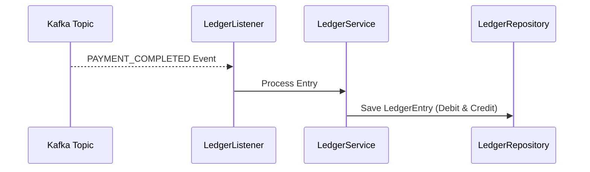

# Ledger Service

The Ledger Service acts as the immutable journal (double-entry bookkeeping book) for all financial movements. It consumes payment completion events and updates the registry of ledger entries.

---

## 🧭 Navigation

- 🏠 **[Workspace Root README](../../README.md)**
- 📁 **[StateMachine Payments Root README](../README.md)**

---

## 🏗️ Architecture & Flow

- **Kafka Consumer**: Listens to the transaction completion events.
- **Double Entry Journal**: For every completed payment, it records corresponding debit and credit records ensuring auditing integrity.
- **Observability**: Implements custom micrometer observers to track record commit counts and ingestion delays.
