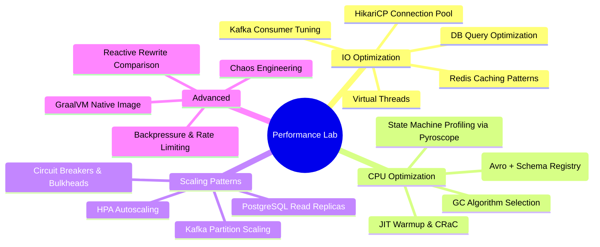

# 🧪 Java Scaling & Performance Optimization — Experiment Lab

> **Cluster:** 3-node Talos Linux K8s (48GB RAM, 16 CPUs) | **ArgoCD GitOps**
> **Services:** payment-service, wallet-service, ledger-service, export-batch-service, mock-regulatory-service
> **Stack:** Spring Boot 3.x, Java 21, Kafka 3-broker KRaft, PostgreSQL, Redis Cluster (6 nodes), Schema Registry
> **Observability:** Prometheus + Grafana (17 dashboards) + Loki + Tempo + Pyroscope — **already operational**
> **Instrumentation:** OTel Java Agent (traces) + Pyroscope Agent (JFR profiles) — **already attached to all services**

---

## 🗺️ Experiment Map



---

## ⚠️ Immediate Action: Set Resource Limits

> [!CAUTION]
> All 5 microservices have **NO resource requests or limits**. Any service can consume unbounded CPU/memory, causing noisy-neighbor problems and making experiment results unreliable.

```yaml
# Add to each microservice deployment BEFORE starting experiments:
resources:
  requests:
    cpu: 250m
    memory: 512Mi
  limits:
    cpu: 1000m
    memory: 1Gi
```

Without limits, Kubernetes scheduler can't make informed decisions, HPA won't work, and metrics will be misleading.

---

## Phase 0: Load Testing Harness

> [!NOTE]
> Observability is already excellent — Grafana (17 dashboards), Tempo (distributed tracing), Pyroscope (continuous profiling), Loki (logs). You only need to build the **load generator**.

### Experiment 0.1: k6 Load Test Suite
**Goal:** Reproducible load generation against the full payment flow  
**What to build:**
- k6 script simulating end-to-end payment lifecycle:
    1. `POST /api/v1/payments` → create payment (payment-service)
    2. Kafka → fraud check (automatic via event flow)
    3. Poll payment status until `FRAUD_APPROVED` / `FRAUD_REJECTED`
    4. `POST /api/v1/payments/{id}/process` → process
    5. `POST /api/v1/payments/{id}/complete` → complete
- Also test wallet-service and ledger-service endpoints
- Ramp profiles: 10→100→500→1000 concurrent users
- Deploy k6 as K8s Job in `applications` namespace

**Metrics to capture (already available):**
- Throughput (req/s) — Grafana Spring Boot dashboards
- p50/p95/p99 latency — Prometheus histograms
- Error rate — Actuator metrics
- End-to-end trace latency — Tempo
- JVM hotspots during load — Pyroscope

**What to verify first:**
- Check existing dashboards: `Spring Boot Actuator UI`, `JVM Metrics`, `Payment State Machine`
- Verify Tempo traces flow: payment-service → Kafka → wallet-service/ledger-service
- Verify Pyroscope profiles appear under load

**Learn:** Baseline performance of your system before any optimization

---

## Phase 1: IO Optimization Experiments

### Experiment 1.1: HikariCP Connection Pool Tuning
**Goal:** Find optimal DB connection pool size for your workload  
**Hypothesis:** Default pool (10 connections) bottlenecks under 200+ concurrent requests  
**Context:** All 5 services share **one PostgreSQL instance** (`titan_db`) — connection starvation is a real risk  
**Experiment:**
```yaml
# Test these configurations under constant load (vary per service):
spring.datasource.hikari.maximum-pool-size: [5, 10, 20, 30, 50]
spring.datasource.hikari.minimum-idle: [2, 5, 10]
spring.datasource.hikari.connection-timeout: [10000, 20000, 30000]
spring.datasource.hikari.leak-detection-threshold: 30000
```

**Watch in Grafana:** `hikaricp_connections_active`, `hikaricp_connections_pending`, `hikaricp_connections_timeout_total`  
**Watch in Tempo:** DB call duration within traces  
**Formula to test:** `pool_size = (core_count * 2) + effective_spindle_count`

**Bonus:** Configure HikariCP metrics exposure (add `spring.datasource.hikari.register-mbeans: true`) and create a dedicated Grafana dashboard panel

**Learn:** Connection pool sizing, shared DB contention between microservices

---

### Experiment 1.2: Virtual Threads (Project Loom)
**Goal:** Compare platform threads vs virtual threads for IO-heavy services  
**Hypothesis:** Virtual threads boost throughput for payment-service (DB + Kafka + Redis + HTTP to wallet-service)  
**Experiment:**
```yaml
# Option A: Platform threads (baseline)
spring.threads.virtual.enabled: false
server.tomcat.threads.max: 200

# Option B: Virtual threads
spring.threads.virtual.enabled: true
```

**Test with:** 500–2000 concurrent payment creation requests  
**Watch in Grafana:** `jvm_threads_live`, throughput, p99 latency  
**Watch in Pyroscope:** Thread state distribution (RUNNABLE vs WAITING vs TIMED_WAITING)  
**Watch in Tempo:** Per-span duration changes

**Pitfalls to hunt for:**
- `synchronized` blocks causing carrier thread pinning — detect with `-Djdk.tracePinnedThreads=short`
- Spring Statemachine internals (uses `synchronized`?)
- HikariCP pinning (check if version supports virtual threads)
- Redis Cluster client (Lettuce) compatibility with virtual threads

**Deploy approach:** Update ConfigMap with JVM args, rolling restart via ArgoCD

**Learn:** When virtual threads help vs hurt, pinning detection, real-world Loom adoption

---

### Experiment 1.3: Kafka Consumer Concurrency & Batching
**Goal:** Maximize Kafka consumption throughput in all consumer services  
**Context:** 3 Kafka brokers, Schema Registry available but may not be in use yet  
**Experiment matrix:**

| Config | Partitions per topic | Consumer concurrency | Batch mode | Poll records |
|---|---|---|---|---|
| Baseline | current | current | single | default |
| Scaled threads | current | 6 | single | default |
| Partition match | 6 | 6 | single | default |
| Batch small | 6 | 6 | batch | 50 |
| Batch large | 12 | 12 | batch | 500 |

```yaml
# Batch mode config:
spring.kafka.listener.type: batch
spring.kafka.consumer.max-poll-records: 500
spring.kafka.consumer.fetch-min-size: 1048576  # 1MB
spring.kafka.consumer.fetch-max-wait: 500ms
```

**Also test:**
- `CooperativeStickyAssignor` vs `RangeAssignor` — measure rebalance storm duration
- Consumer lag during service restarts (simulate with `kubectl rollout restart`)

**Watch:** Kafka Exporter dashboard in Grafana, consumer lag, message throughput  
**Watch in Tempo:** Kafka consumer span durations

**Learn:** Partitions-to-consumers ratio, batch processing trade-offs, rebalance strategies

---

### Experiment 1.4: Redis Caching Strategies
**Goal:** Reduce PostgreSQL load with intelligent caching  
**Context:** Redis Cluster (6 nodes, 3 masters + 3 replicas) — plenty of capacity  
**Experiment layers:**

| Strategy | Implementation | Expected Impact |
|---|---|---|
| **Cache-aside** | `@Cacheable` on `findById` (payment, wallet, ledger) | Reduce DB reads 60-80% |
| **Write-through** | Update cache on every state transition | Always-fresh, small write cost |
| **TTL sweep** | Test TTLs: 30s, 60s, 300s, 900s | Freshness vs DB load |
| **Cache stampede guard** | `sync=true` + `@CacheLock` pattern | Prevent thundering herd |
| **Idempotency cache** | `SETNX` with TTL for Kafka consumer deduplication | Prevent duplicate event processing |

**Redis Cluster consideration:** Use hash tags `{paymentId}` to ensure related keys land on same shard

**Watch:** `PostgreSQL Overview` dashboard (query rate drop), Redis dashboard (hit/miss ratio, memory)  
**Watch in Tempo:** DB call count per trace before/after caching

**Learn:** Caching in event-driven architectures, cache invalidation, Redis Cluster key distribution

---

### Experiment 1.5: Database Query Optimization
**Goal:** Find and fix slow queries under load  
**Experiment steps:**
1. Enable Hibernate statistics: `spring.jpa.properties.hibernate.generate_statistics: true`
2. Enable slow query log in PostgreSQL: `log_min_duration_statement: 100` (ms)
3. Run load test, collect slow queries from Loki (PostgreSQL logs)
4. Identify N+1 queries via Tempo traces (many sequential DB spans)
5. Test batch operations:
   ```yaml
   spring.jpa.properties.hibernate.jdbc.batch_size: 25
   spring.jpa.properties.hibernate.order_inserts: true
   spring.jpa.properties.hibernate.order_updates: true
   ```
6. Add indexes on hot columns: `payment.status`, `payment.created_at`, `wallet.user_id`
7. Benchmark: `findByStatus()` with vs without index under 1M rows
8. Test prepared statement caching: `spring.datasource.hikari.data-source-properties.prepStmtCacheSize: 250`

**Watch:** `PostgreSQL Overview` dashboard — query time, cache hit ratio, active connections  
**Watch in Pyroscope:** Time spent in Hibernate/JDBC methods

**Learn:** ORM query patterns at scale, indexing strategy, N+1 detection via distributed tracing

---

## Phase 2: CPU Optimization Experiments

### Experiment 2.1: JVM Garbage Collection Tuning
**Goal:** Find optimal GC for each service's workload profile  
**Context:** payment-service (high throughput, latency-sensitive) vs export-batch-service (batch processing, throughput-focused)

| GC | JVM Flag | Best For | Test On |
|---|---|---|---|
| **G1GC** (default) | `-XX:+UseG1GC` | Balanced baseline | All services |
| **ZGC** | `-XX:+UseZGC` | Ultra-low latency (<1ms pauses) | payment-service |
| **Shenandoah** | `-XX:+UseShenandoahGC` | Low latency, concurrent | payment-service |
| **Parallel GC** | `-XX:+UseParallelGC` | Max throughput | export-batch-service |

**Per GC, tune heap:**
```bash
# Conservative
-Xms512m -Xmx1g

# Generous
-Xms1g -Xmx2g

# G1 specific
-XX:MaxGCPauseMillis=50
-XX:+UseStringDeduplication  # Save memory on payment descriptions

# ZGC specific  
-XX:SoftMaxHeapSize=768m
```

**Deploy:** Add `JAVA_TOOL_OPTIONS` to ConfigMap, ArgoCD auto-syncs  
**Test:** Sustained 500 req/s for 30 minutes per GC config  
**Watch in Grafana:** `JVM Metrics` dashboard — GC pause histograms, heap usage, CPU  
**Watch in Pyroscope:** GC-related method time (compare flame graphs across GC algos)

**Learn:** GC algorithm trade-offs, how to read GC logs (`-Xlog:gc*:file=/tmp/gc.log`), choosing GC per workload type

---

### Experiment 2.2: JIT Warmup & CRaC Checkpoint/Restore
**Goal:** Reduce cold-start latency impact on scaling events  
**Context:** When HPA scales up pods, new instances serve slow requests during JIT warmup

**Stage 1: Measure warmup**
- Deploy fresh pod, capture p99 latency for first 60s vs steady-state
- Watch in Tempo: trace duration for first N requests vs later ones
- Watch in Pyroscope: JIT compilation overhead in flame graph

**Stage 2: Class Data Sharing (CDS)**
```bash
# Generate CDS archive during build
java -XX:ArchiveClassesAtExit=app-cds.jsa -jar payment-service.jar
# Use CDS archive at startup
java -XX:SharedArchiveFile=app-cds.jsa -jar payment-service.jar
```

**Stage 3: CRaC (Coordinated Restore at Checkpoint)**
```xml
<dependency>
    <groupId>org.crac</groupId>
    <artifactId>crac</artifactId>
    <version>1.4.0</version>
</dependency>
```
- Take checkpoint after warmup (100+ requests processed)
- Restore from checkpoint — near-instant startup with warmed JIT

**Compare:**

| Mode | Startup Time | First Request Latency |
|---|---|---|
| Cold JVM | ~3-5s | High (JIT compiling) |
| CDS | ~1-2s | Medium |
| CRaC | <100ms | Low (pre-warmed) |

**Learn:** JIT compilation tiers, startup optimization for autoscaled microservices

---

### Experiment 2.3: Serialization — Avro + Schema Registry
**Goal:** Replace JSON Kafka serialization with Avro using your existing Schema Registry  
**Context:** Schema Registry (`schema.homelab`) already deployed — leverage it!

**Implementation:**
```xml
<dependency>
    <groupId>io.confluent</groupId>
    <artifactId>kafka-avro-serializer</artifactId>
</dependency>
```
```yaml
spring.kafka.producer.value-serializer: io.confluent.kafka.serializers.KafkaAvroSerializer
spring.kafka.consumer.value-deserializer: io.confluent.kafka.serializers.KafkaAvroDeserializer
spring.kafka.properties.schema.registry.url: http://schema-registry.messaging.svc.cluster.local:8081
```

**Define `.avsc` schemas** for all Kafka events (payment events, fraud events, notification events)

**Compare (JMH microbenchmark):**

| Serializer | Message Size | Ser/Deser Time | Schema Evolution |
|---|---|---|---|
| Jackson JSON (current) | ~500 bytes | Baseline | Manual |
| Avro + Schema Registry | ~100-150 bytes | 3-5x faster | Built-in |
| Protobuf | ~120 bytes | 3-5x faster | Built-in |

**Watch in Grafana:** Kafka dashboard — bytes/s throughput, broker disk usage reduction  
**Watch in Tempo:** Serialization overhead in producer/consumer spans

**Learn:** Schema evolution strategies, binary serialization impact on Kafka throughput, Schema Registry workflow

---

### Experiment 2.4: State Machine & Service Profiling via Pyroscope
**Goal:** Find CPU hotspots using your already-deployed continuous profiler  
**Context:** Pyroscope is already collecting JFR profiles from all services — just analyze them!

**Steps:**
1. Open `grafana.homelab` → `Continuous Profiling` dashboard
2. Run load test (Experiment 0.1)
3. In Pyroscope, select `payment-service`:
    - **CPU profile:** Where does payment-service spend CPU time?
    - **Allocation profile:** What allocates the most objects? (GC pressure source)
    - **Lock profile:** Where are threads contending?
4. Compare flame graphs: `payment-service` vs `wallet-service` vs `ledger-service`
5. **Diff flame graph:** Compare before/after any optimization (Pyroscope supports this natively)

**What to look for:**
- Spring Statemachine transition overhead per payment
- Serialization/deserialization hotspots
- Kafka producer/consumer framework overhead
- Hibernate query compilation
- Reflection overhead (MapStruct should eliminate this — verify)

**Actionable follow-up:** If state machine is hot → benchmark enum-based FSM alternative  
**Learn:** Flame graph reading, differential profiling, finding real bottlenecks vs assumed ones

---

## Phase 3: Scaling Experiments

### Experiment 3.1: Horizontal Pod Autoscaler (HPA)
**Goal:** Auto-scale microservices based on load  
**Context:** `metrics-server` v3.12.1 already deployed — HPA can work immediately  
**Prerequisite:** Set resource requests/limits (see Immediate Action above)

**Stage 1: CPU-based HPA**
```yaml
apiVersion: autoscaling/v2
kind: HorizontalPodAutoscaler
metadata:
  name: payment-service-hpa
  namespace: applications
spec:
  scaleTargetRef:
    apiVersion: apps/v1
    kind: Deployment
    name: payment-service
  minReplicas: 1
  maxReplicas: 6
  metrics:
  - type: Resource
    resource:
      name: cpu
      target:
        type: Utilization
        averageUtilization: 70
  behavior:
    scaleUp:
      stabilizationWindowSeconds: 30
      policies:
      - type: Pods
        value: 2
        periodSeconds: 60
    scaleDown:
      stabilizationWindowSeconds: 300
```

**Stage 2: Custom metrics HPA (requires Prometheus Adapter)**
```yaml
# Scale based on request rate or Kafka consumer lag
- type: Pods
  pods:
    metric:
      name: http_server_requests_per_second
    target:
      type: AverageValue
      averageValue: "100"
```

**Test scenario:**
1. Baseline: 1 replica, 50 req/s
2. Ramp to 500 req/s → watch scale-up
3. Drop to 50 req/s → watch scale-down (5min stabilization)
4. Observe: Kafka consumer rebalancing during scale events, cold connection pool on new pods

**Watch:** Cluster Overview dashboard, `kubectl get hpa -w`, pod count over time  
**Watch in Tempo:** Trace latency during scale-up (new pods with cold JIT)

**Learn:** HPA tuning, scale-up/down dynamics, Kafka rebalance during scaling, cold-start impact

---

### Experiment 3.2: Kafka Partition Scaling
**Goal:** Scale Kafka throughput by increasing partitions  
**Context:** 3 brokers available, replication factor likely 3 already

| Config | Partitions | Consumer Pods | Concurrency per Pod | Expected |
|---|---|---|---|---|
| Baseline | current | 1 | current | X msg/s |
| Double | 6 | 2 | 3 | ~2X |
| Heavy | 12 | 3 | 4 | ~3-4X |
| Over-partitioned | 24 | 3 | 4 | Diminishing returns |

**Also test:**
- Consumer rebalance duration: `CooperativeStickyAssignor` vs default
- Partition key strategy: by `paymentId` (ordering guarantee) vs random (max throughput)
- What happens when consumer pod restarts mid-batch

**Watch:** Kafka Exporter Overview dashboard — consumer lag, partition throughput  
**Watch in Tempo:** End-to-end event latency (creation → notification)

**Learn:** Partition-consumer scaling law, ordering vs throughput trade-off

---

### Experiment 3.3: PostgreSQL Read Replicas
**Goal:** Scale reads by adding streaming replication  
**Context:** Single PostgreSQL primary (Bitnami chart), all 5 services write+read from it

**Implementation with Bitnami chart:**
```yaml
# Update Helm values for PostgreSQL:
architecture: replication
readReplicas:
  replicaCount: 2
  resources:
    requests:
      cpu: 250m
      memory: 256Mi
    limits:
      cpu: 1000m
      memory: 1024Mi
```

**Spring routing datasource:**
```java
// Route @Transactional(readOnly = true) to replica
public class ReadWriteRoutingDataSource extends AbstractRoutingDataSource {
    @Override
    protected Object determineCurrentLookupKey() {
        return TransactionSynchronizationManager.isCurrentTransactionReadOnly() 
            ? "replica" : "primary";
    }
}
```

**Test:** 80% read / 20% write workload at 1000 req/s  
**Watch:** PostgreSQL Overview dashboard — primary vs replica query distribution  
**Measure:** Replication lag, read latency improvement, primary CPU relief

**Learn:** Read replica routing in Spring, replication lag trade-offs, Bitnami HA setup

---

### Experiment 3.4: Circuit Breaker & Bulkhead (Resilience4j)
**Goal:** Prevent cascade failures  
**Context:** payment-service calls wallet-service via HTTP, mock-regulatory-service has **10% built-in failure rate** — perfect chaos target

```java
// Circuit breaker for wallet-service calls
@CircuitBreaker(name = "walletService", fallbackMethod = "walletFallback")
@Bulkhead(name = "walletService", type = Bulkhead.Type.THREADPOOL)
@TimeLimiter(name = "walletService")
public CompletableFuture<WalletResponse> debitWallet(WalletRequest req) { ... }

// Circuit breaker for regulatory service calls (in export-batch-service)
@CircuitBreaker(name = "regulatoryService", fallbackMethod = "regulatoryFallback")
public RegulatoryResponse submitReport(Report report) { ... }
```

**Experiments:**
1. Kill wallet-service pod → observe circuit breaker opening in payment-service, fallback
2. Scale mock-regulatory-service to 0 → watch export-batch-service circuit breaker
3. Inject 5s latency → bulkhead prevents thread starvation
4. Measure: time-to-open, half-open probe, recovery time

**Watch in Tempo:** Circuit breaker state transitions visible in traces  
**Watch in Grafana:** Custom Resilience4j metrics (circuit breaker state, call count, failure rate)

**Learn:** Resilience patterns, failure isolation, graceful degradation

---

## Phase 4: Advanced Experiments

### Experiment 4.1: Reactive Rewrite (WebFlux) — payment-service
**Goal:** Compare blocking (Tomcat) vs non-blocking (Netty/WebFlux)  
**Approach:**
- Create `payment-service-reactive` module alongside original
- Use `spring-boot-starter-webflux` + `spring-data-r2dbc` + `reactor-kafka`
- Same business logic, reactive pipeline
- Deploy both, load test identically

**Compare at 1000 concurrent connections:**

| Metric | Blocking (Tomcat) | Reactive (Netty) |
|---|---|---|
| Threads used | ~200 | ~16 (event loop) |
| Memory footprint | ? | ? |
| Throughput | ? | ? |
| p99 Latency | ? | ? |
| Code complexity | Simple | Higher |
| Pyroscope profile | Thread-heavy | Event-loop-heavy |

**Watch in Pyroscope:** Compare flame graphs — radically different profiles  
**Learn:** When reactive is worth the complexity, event-loop model vs thread-per-request

---

### Experiment 4.2: GraalVM Native Image
**Goal:** Measure startup + throughput impact of AOT compilation  
**Best candidate:** mock-regulatory-service (simplest, no complex dependencies)

```bash
mvn -Pnative native:compile -pl mock-regulatory-service
```

**Compare:**

| Metric | JVM (HotSpot) | Native Image |
|---|---|---|
| Startup time | ~3-5s | <100ms |
| Memory (RSS) | ~300MB | ~50-80MB |
| Peak throughput | Baseline | 10-30% lower (no JIT) |
| Warmup needed | Yes | No |

**Watch in Grafana:** JVM Metrics — memory usage comparison  
**Learn:** AOT vs JIT trade-offs, native image reflection/proxy limitations

---

### Experiment 4.3: Backpressure & Rate Limiting
**Goal:** Protect system from overload, fail gracefully

| Layer | Tool | Config |
|---|---|---|
| Ingress | ingress-nginx rate limit annotation | 100 req/s per IP |
| Application | Resilience4j RateLimiter | 500 req/s total |
| Kafka | `max.poll.records` tuning | Limit consumer batch |
| DB | HikariCP pool saturation | Natural backpressure |

**Test:** Ramp to 5000 req/s → observe:
- Does ingress reject cleanly with 429?
- Does application rate limiter kick in?
- Does Kafka consumer lag grow but not crash?
- Does system recover after load drops?

**Watch all dashboards simultaneously** — this is the ultimate integration test  
**Learn:** Where to apply backpressure, graceful degradation vs crash

---

### Experiment 4.4: Chaos Engineering
**Goal:** Validate resilience under failure conditions  
**Context:** mock-regulatory-service already has 10% failure rate — extend chaos further

**Scenarios:**

| Chaos | Method | Observe |
|---|---|---|
| Pod kill | `kubectl delete pod` randomly | Recovery time, request errors |
| Network partition | NetworkPolicy isolating fraud-service | Circuit breaker activation |
| CPU stress | `stress-ng` sidecar in payment-service | Latency degradation curve |
| Memory pressure | Reduce limits to 256Mi | OOM behavior, pod restarts |
| Kafka broker loss | Scale Kafka to 2 brokers | ISR shrink, producer retry |
| PostgreSQL restart | Delete PostgreSQL pod | Connection pool recovery |

**Learn:** Failure modes, recovery patterns, system resilience boundaries

---

## 📋 Suggested Experiment Order

```mermaid
gantt
    title Experiment Timeline (Suggested Weeks)
    dateFormat  X
    axisFormat Week %s

    section Prerequisites
    Set Resource Limits           :crit, a0, 0, 1
    k6 Load Test Suite (0.1)      :a1, 0, 2

    section IO Quick Wins
    HikariCP Tuning (1.1)         :b1, 2, 3
    Redis Caching (1.4)           :b2, 2, 4
    DB Query Optimization (1.5)   :b3, 3, 5

    section IO Deep Dive
    Virtual Threads (1.2)         :c1, 5, 7
    Kafka Consumer Tuning (1.3)   :c2, 5, 7

    section CPU
    Pyroscope Profiling (2.4)     :d0, 7, 8
    GC Tuning (2.1)               :d1, 8, 10
    Avro + Schema Registry (2.3)  :d2, 10, 12
    JIT & CRaC (2.2)              :d3, 10, 12

    section Scaling
    HPA Autoscaling (3.1)         :e1, 12, 14
    Kafka Partitions (3.2)        :e2, 12, 14
    Circuit Breakers (3.4)        :e3, 14, 16

    section Advanced
    DB Read Replicas (3.3)        :f1, 16, 18
    Backpressure (4.3)            :f2, 18, 19
    Chaos Engineering (4.4)       :f3, 19, 20
    Reactive Rewrite (4.1)        :f4, 20, 24
    Native Image (4.2)            :f5, 24, 26
```



---

## 🎯 Key Learning Outcomes

| Category | Skills Gained |
|---|---|
| **IO Optimization** | Connection pool math, virtual threads & pinning, Kafka consumer models, caching in event-driven systems, query tuning via distributed traces |
| **CPU Optimization** | GC algorithm selection per workload, flame graph reading (Pyroscope), Avro/Schema Registry workflow, JIT warmup strategies |
| **Scaling** | K8s HPA with custom metrics, Kafka partition-consumer scaling, PostgreSQL replication, resilience patterns |
| **Observability** | You already have world-class observability (LGTM+P) — learn to **read and interpret** it under controlled experiments |
| **Resilience** | Circuit breakers, bulkheads, backpressure, chaos engineering, graceful degradation |

---

## 🧰 Your Existing Toolbox (Already Deployed)

| Tool | What You Can Do Right Now |
|---|---|
| **Grafana** (`grafana.homelab`) | 17 dashboards — JVM, Kafka, PostgreSQL, Redis, traces, profiling |
| **Tempo** | End-to-end distributed traces across all 5 services + Kafka |
| **Pyroscope** | Continuous CPU/alloc/lock profiling with diff flame graphs |
| **Loki** | Centralized logs, correlated with traces via `trace_id` |
| **Kafka UI** (`kafka.homelab`) | Topic management, consumer groups, message browsing |
| **pgAdmin** (`pgadmin.homelab`) | Query analysis, EXPLAIN plans, index management |
| **RedisInsight** (`redis-insight.homelab`) | Redis Cluster monitoring, key browser, slow log |
| **metrics-server** | `kubectl top pods/nodes` — ready for HPA |

> [!TIP]
> You have a **production-grade observability stack**. Most engineers never have this for experiments. Start with **Phase 0** (load tests only — dashboards exist), then follow the pattern: **baseline → hypothesis → change one variable → measure → compare flame graphs → document**.